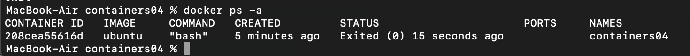

# containers04
1.Lucrare de laborator Nr. 4: Utilizarea containerelor ca medii de execuție

2.Scop

Această lucrare de laborator are ca scop familiarizarea cu comenzile de bază ale sistemelor de operare Debian/Ubuntu. De asemenea, oferă oportunitatea de a lucra cu Docker, un instrument esențial pentru crearea și gestionarea containerelor.

3.Sarcina

Pornind de la imaginea oficială a sistemului de operare Ubuntu, se va crea un container care să conțină un server web Apache. Se va crea o pagină web simplă cu textul "Hello, World!" care va fi accesibilă printr-un browser.

4.Descrierea executării lucrării de laborator.

docker run -ti -p 8000:80 --name containers04 ubuntu bash
Această comandă va crea un container denumit containers04, mapând portul 80 al containerului la portul 8000 al gazdei, și va deschide un terminal interactiv.

apt update                          # Actualizarea listei de pachete
apt install apache2 -y              # Instalarea serverului web Apache
service apache2 start               # Pornirea serverului web
Comenzi pentru instalarea si configurarea Apache

http://localhost:8000
Testarea serverului apache

ls -l /var/www/html/                # Listarea conținutului directorului web

echo '<h1>Hello, World!</h1>' > /var/www/html/index.html
A aparut textul "Hello, World!" in pagina.

cd /etc/apache2/sites-enabled/
cat 000-default.conf
Această comandă afișează configurația serverului Apache, inclusiv rădăcina documentului web (/var/www/html/).

exit  # Închiderea sesiunii containerului

docker ps -a  # Listarea tuturor containerelor

docker rm containers04  # Ștergerea containerului

5.Concluzii

În urma acestei lucrări de laborator, am reușit să:

Creăm și rulăm un container Docker bazat pe Ubuntu.

Instalăm și configurăm un server web Apache.

Creăm o pagină web simplă afișată prin Apache.

Gestionăm ciclul de viață al unui container (creare, rulare, închidere și ștergere).

Această experiență oferă o bază solidă pentru utilizarea containerelor ca medii de execuție în dezvoltarea și testarea aplicațiilor.

